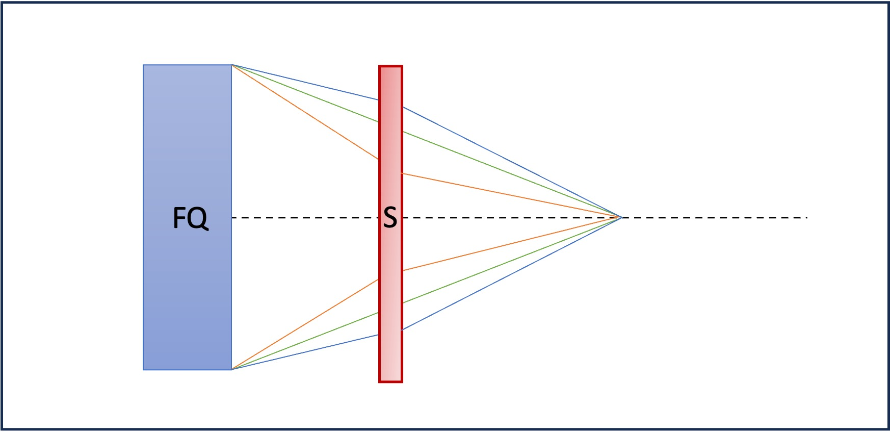

# MAD-X WORKSHOP JUAS 2024
**N. Fuster-Marti­nez, G. Sterbini, D. Gamba, S. Kostoglou, J. Olivares** 

## Tutorial 1: My first accelerator, a FODO cell

The main goal of this tutorial is to ensure that we all have a working enviroment and to get familiar with the MAD-X pythonic approach. In order to do that, we are going to define a simple magnetic lattice, a FODO cell, which is the simplest configuration we can design to get a net focusing effect of the beam in both transverse planes, and compute the linear optics functions.

Figure 1: FODO cell scheme with main parameters depicted.

Questions:
    
1. Define a FODO cell with the parameters below. Then, define a proton beam with a total energy, $E_{tot}$, of 2 GeV. Activate the sequence and compute the periodic linear optics functions with the twiss MAD-X command. Then, plot the $\beta$-functions. If you found a maximum $\beta$-function around 460 m you succeeded!

   FODO cell specifications:

      - the length of the cell, $L_{cell}$ = 100 m,
      - two quadrupoles, one focusing (FQ) and another one defocusing (DQ), of 5 m long ($L_{q}$),
      - the start of the sequence placed at the start of the first quadrupole,
      - the quadrupole focal length f = 200 m. HINT: K1 x $L_{q}$= 1/f,
      - equal length drift spaces.
     

2. Using the $\beta$-function plot obtained, can you estimate the phase advance of the cell? How does this value compare to the tune computed by MAD-X.
   
   $\psi (s)=\int_0^s \frac{1}{\beta (s)} ds$
    
4. Try to run the twiss command with $E_{tot}$ = 0.7 GeV. What is the MAD-X error message? And if you change the focal length to 20 m? Note that the error messages could appear in the jupyter notebook or in the terminal from which you launched the JupyterLab.

## Tutorial 2: My first matching

The main goal of this tutorial is to study the behavior of the linear optics functions when we vary the FODO cell magnetic properties. For that, we will use the linear thin lens optics solution and the twiss MAD-X module. The results of the two approaches will be compared and discussed.

By considering the periodic solution of the equation of motion of a charged particle in a FODO cell, and applying the thin lens approximation and the stability condition, we can derive the following relationships between the optical parameters, the magnet properties and the cell length:

Figure 2: FODO cell equations relating linear optics functions and magnet and FODO cell parameters.

  

Figure 3: Phase advance (left) and maximum and minimum $\beta$-functions as a function of the FODO magnets and cell parameters.

  

Questions:

1. Using the thin lens approximation solution from Fig. 3 (left) compute the required strength to power the quadrupoles to obtain a phase advance in the FODO cell of 90 degrees. Using the calculated K value, compute the linear optics functions using MAD-X. What is the phase advance computed by MAD-X?

2. And the $\beta_{max}$ value computed by MAD-X? Compare the obtained value with the thin lens approximation solution from Fig. 3 (right).

3. Reduce by half the focusing strength of the quadrupoles, what is the effect of it on the $\beta_{max}$, $\beta_{min}$ and $\Delta \mu$? Compare the obtained values with the thin lens approximation from Fig. 3.

4. Compute the maximum beam size, $\sigma_{x,y}$ ,ƒ assuming a normalized horizontal and vertical emittance, $\epsilon_n^{x,y}$, of 3 mrad mm and $E_{tot}$ = 7 TeV using the following relation:

    $\sigma_{x,y}=\sqrt{\frac{\beta_{x,y}\epsilon_n^{x,y}}{\gamma}}$
    
    where $\gamma$ stands for the relativistic factor.

## Tutorial 3: Building a circular machine

The main goal of this tutorial is to install dipole magnets in the FODO cell designed in Tutorial 1 to build a circular machine as well as to study the impact of the dipoles into the linear optics functions. In addition, the MAD-X matching module will be used to define the required quadrupole's strength for getting a desired tune of the machine. The tune is a crucial parameter in the design of a circular machine for getting the desired beam quality and stability. 

Figure 4: Scheme of a FODO cell with dipoles.

Questions:

1. Consider the first FODO cell designed in Tutorial 2 and add 4 sector dipoles of 15 m long, $L_d$, assuming a drift space between the magnets as illustrated in Fig. 4.  For computing the required bending angle, consider a ring with 736 dipoles with equal bending angles.

	In order to install the dipoles in the lattice, first define the new element with the appropriate MAD-X command:

	 	mb : sbend, angle = ??, l = ??; 
	
	Then, introduce them into the sequence description block and define their location:

	 	mb1 : mb, at = ??; 

2. Using the twiss command compute the linear optics functions. Do the dipoles (weak focusing) affect the maximum of the $\beta$-functions? And the dispersion? 

3. From the phase advance of the FODO cell compute the horizontal and vertical tunes of the machine.

4. Using the MAD-X match block on a single FODO cell, match the tunes of the machine to 46.0 in both planes.

		match, sequence = ??;
		global, q1 = ??;
		global, q2 = ??;
		vary, name = ??, step = 0.00001;
		vary, name = ??, step = 0.00001;
		lmdif, call = 50, tolerance = 1e-6;
		endmatch;

5. If we change the beam energy to a total beam energy of 7 TeV, which are the new tunes of the machine? Why?

6. What is the maximum tune that you can reach with such a lattice? HINT: what is the maximum phase advance per FODO cell in the thin lens approximation?

## Tutorial 4: Natural chromaticity

The main goal of this tutorial is to study the impact of the natural chromaticity of a FODO cell on the particles' beam dynamics by means of particle tracking studies. Fig. 5 illustrates the chromaticity concept in a quadrupole magnet. Orange and blue lines correspond to off-momentum particles and the green line represents the on-momentum particle. In this illustration, we observe an spread in the focusing effect of the quadrupole, which is caused by the energy spread of the beam, known as chromaticity.

Figure 5: Chromaticity effect illustration.

In order to do this tutorial, we will use as starting point, the thin lens version of the lattice designed in Tutorial 3 and we will consider a 7 TeV total energy proton beam. Here, the use of a thin lens lattice is mandatory in order to use the track MAD-X module. The makethin command should be used for this purpose. Additionally, after running the makethin command, it will be necessary to perform a rematch of the lattice to ensure that the horizontal and vertical tunes of the FODO cell remain at 0.25. All this steps are implemented for you on the Tutorial4.madx file.

Questions:

1. Run the Tutorial4.madx file to compute the twiss of the new thin lens lattice. Using the chromaticity computed using the twiss command, compute the tunes for particles with $\Delta p/p = 10^{-3}$ using the following equation:

     $\Delta Q = dq \times \frac{\Delta p}{p}$

2. Track two particles, one with initial coordinates x, y, px, py = (1 mm, 1 mm, 0, 0) and another one with initial coordinates x, y, px, py = (100 mm, 100 mm, 0, 0) in 100 turns. Plot the horizontal and vertical phase space, x-px and y-py respectively. How do the particles move in the phase space turn after turn? Do you see the tunes? Do you see any difference between the two particles? It may help to look only at the first 4 turns to get a clear picture.

		track, dump, file = name, deltap = ??;
		start, x = ??, px = ?? , y = ??, py = ??;
		start, x = ??, px = ?? , y = ??, py = ??;
		run, turns = 100;
		
3. Repeat the tracking exercise but now for two of-momentum particles by adding a $\Delta p/p = 10^{-2}$ to the initial particles' conditions. How does the phase space look now? Is the tune still the same?

## Tutorial 5: Chromaticity correction and non-linearities
  
The goal of this tutorial is to design a chromaticity correction scheme for the FODO cell of Tutorial 4 by installing sextupoles. Then, the impact of the sextupoles on the particles' beam dynamics will be evaluated by means of tracking studies.

Figure 6: Chromaticity correction scheme.

Figure 7: FODO cell with dipoles and sextupoles scheme.

Questions:

1.  Install two 0.5 m long sextupoles attached to the two quadrupoles. 

	In order to install the sextupoles in the lattice, first define the new element with the appropriate MAD-X command:

	 	sm : sextupole, k2 = ??, l = ??; 
	
	Then, introduce them into the sequence description block:

	 	s1 : sm, at = ??;

	Then, with a MAD-X matching block adjust the vertical and horizontal chromaticity of the cell (global parameters: DQ1 and DQ2) to zero, by 	powering the two sextupoles. 
	 

2. Using the strength of the sextupoles and the linear optics functions ($\beta$-function and dispersion) at the sextupole' location, evaluate the sextupole's contribution to the chromaticity on the horizontal plane using the equation above.  Then, compare the obtained values with the chromaticity value obtained in Tutorial 4.

2. Using the strength of the sextupoles and the linear optics functions ($\beta$-function and dispersion) at the sextupole' location, evaluate the sextupole's contribution to the chromaticity on the horizontal plane using the equation above. Then, compare the obtained values with the chromaticity value obtained in Tutorial 4.

3. Track two particles, one with initial coordinates x, y, px, py = (1 mm, 1 mm, 0, 0) and another one with initial coordinates x, y, px, py = (100 mm, 100 mm, 0, 0) and both with $\Delta p/p = 0.01$ for 100 turns. Plot the horizontal and vertical phase space, x-px and y-py respectively. Did you manage to recover the original tune for the off-momentum particle from Tutorial 4? Do you see the tunes? What is going on?

4. Move the tunes to (0.23, 0.23) and repeat the tracking exercise. Are the particles stable?

## Tutorial 6: Building a transfer line

The main objective of this tutorial is to design a transfer line and setting the linear optics functions at the end of the line to some desired values. Matching studies for different initial conditions will be performed and the results discussed.

Figure 6: Transfer line scheme.

Questions:

1. Build a transfer line for a 2 GeV proton beam of 10 m total length, $L_{tot}$, with 4 quadrupoles of 0.1 m long, $L_q$, and a strength of 0.1 $m^{-2}$. Place the quadrupoles centered at 2, 4, 6, and 8 m. What is the error message that you get if you try to find a periodic solution? Why? 

2. Compute the linear optics functions for the transfer line assuming ($\beta_{x}$ , $\alpha_{x}$ , $\beta_{y}$ , $\alpha_{y}$) = (1 m, 0, 2 m, 0) at the start of it. What are the values of the linear optics functions at the end of the transfer line ($\beta_{x, end1}$ , $\alpha_{x, end1}$ , $\beta_{y, end1}$ , $\alpha_{y, end1}$)?

	In order to define the linear optics functions at the beginning of the beamline:

		twiss, sequence = name, betx = ??, alfx = ??, bety = ??, alfy = ??;

3. Starting from ($\beta_{x}$ , $\alpha_{x}$ , $\beta_{y}$ , $\alpha_{y}$) = (1 m, 0, 2 m, 0) match the line to get at the end of the transfer line the following optics ($\beta_{x, end2}$ , $\alpha_{x, end2}$ , $\beta_{y, end2}$ , $\alpha_{y, end2}$) = (2 m, 0, 1 m, 0).

	In order to perform a local matching, use the commands below:

		match, sequence = ??;
		constraint, range = #e, betx = ??;
		constraint, range = #e, alfx = ??;
		vary, name = ??, step = 0.00001;
		vary, name = ??, step = 0.00001;
		lmdif, call = 50, tolerance = 1e-6;
		endmatch;
		
4. Now, starting from ($\beta_{x}$ , $\alpha_{x}$ , $\beta_{y}$ , $\alpha_{y}$) = (1 m, 0, 2 m, 0) and the quadrupoles' strength computed in question 3, match the linear optics functions at the end of the beamline ($\beta_{x, end1}$ , $\alpha_{x, end1}$ , $\beta_{y, end1}$ , $\alpha_{y, end1}$) to the ones found in question number 2. Can you find back the initial quadrupoles' strength of 0.1 $m^{-2}$ from question 1?

5. Consider that the quadrupoles have an excitation current of a 100 A · $m^{2}$ and an excitation magnetic factor of 2 T/m/A and an aperture of 40 mm diameter. Compute the magnetic field at the poles of the four quadrupoles for the two matching solutions obtained in question 2 and 4 assuming a linear regime and using a dimensional approach.
