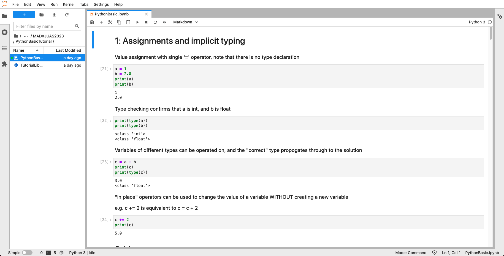

# INSTALLATION AND TEST GUIDE FOR THE MAD-X WORKSHOP AT JUAS 2025
**Material based on CAS 2022 from D. Gamba, G. Sterbini and S. Albright** 

During the course we will use **Python3** in a **[Jupyter](https://jupyter.org)** environment and, mostly, the [numpy](https://numpy.org/), [matplotlib](https://matplotlib.org/), [cpymad](http://hibtc.github.io/cpymad/index.html) and [pandas](https://pandas.pydata.org/) packages. We will explain in the following sections how to install all necessary software on **your laptop**.

A basic knowledge of Python is assumed. If you are not familiar with Python, you can find a few resources to fill the gap in the following sections. Do not worry about the theory for the moment (it will be discussed in details during the school) but focus on the Python syntax and data types (tuples, lists,...).

After [a short introduction](#a-very-short-introduction-to-python), where we provided some useful links to get familiar with Python, we will focus on the [software setup](#software-setup). 
Finally, in [appendix B](#appendix-B-python-packages) you will find links and cheatsheets for the most common Python packages that will be used during the course.

> **Important:** we kindly ask you to go throw this document **before coming** to JUAS, to **prepare yourself** (and **your laptop**) for the MAD-X workshop. 

---
# A very short introduction to Python
You can find several nice courses, videos and resources on the internet. Here you have a couple of suggestions you can find on YouTube:

[Python for Beginners - Learn Python in 1 Hour](http://www.youtube.com/watch?v=kqtD5dpn9C8)

[Learn Python - Full Course for Beginners](http://www.youtube.com/watch?v=rfscVS0vtbw)

You can also follow the tutorials [here](https://www.kaggle.com/code/colinmorris/hello-python).


### Test Python on a web page

If you are not familiar with Python, and you do not have it installed on your laptop, you can start playing with simple python snippets on the web (e.g., [CoLab](https://colab.research.google.com/drive/1Pk-UPE2-OCA2UCFIunqDwxXmQi9Yvp-C?usp=sharing), a google account is needed).

---
# Software Setup

In this section, we will explain how to install Python and JupyterLab on your laptop.
JupyterLab is a user-friendly environment to work with Python. 
You can find an overview on JupyterLab [here](https://jupyterlab.readthedocs.io/en/stable/).

> If you already have your favorite Python distribution installed on your laptop, including JupyterLab, you might want to skip the [installation](#installation) and jump to [launch Jupyter Lab](#launch-jupyter) and test that everything works downloading and executing [this Jupyter-notebook](PythonBasicTutorial/PythonBasic.ipynb) (in order to run all the examples you need also to download [MyFirstExample.madx](PythonBasicTutorial/MyFirstExample.madx) and [TutorialLibraryOfFunctions.py](PythonBasicTutorial/TutorialLibraryOfFunctions.py).

## Installation

We suggest to install the **Anaconda** distribution from [here](https://www.anaconda.com/download). In order to download you may need to register.

> We suggest to install one of the latest distribution (**for example version Python 3.12**). 

The installation process clearly depends on your operating system. We suggest you to follow the official documentation for [Windows](https://docs.anaconda.com/anaconda/install/windows/), [Linux](https://docs.anaconda.com/anaconda/install/linux/), or [Mac](https://docs.anaconda.com/anaconda/install/mac-os/) as appropriate. After having installed **Anaconda** we invite you to [verify your installation](https://docs.anaconda.com/anaconda/install/verify-install/) - as suggested in the [installation documentation](https://docs.anaconda.com/anaconda/install/).

Then, check that you have installed the main python packages (`numpy`, `matplotlib`, `jupyter`, `jupyterlab`, `cpymad` and `pandas`) needed for the workshop. In order to do that you can open a Consol from the Anaconda Navigator and use the `pip` package management system. Note that you may need to install it before using the following command:

```
conda install pip
``` 

Then, you can check for the installed packages you can type:

```
pip list
```

If you have some missing packages, install them independently, e.g.:

```python
pip install numpy matplotlib jupyter jupyterlab cpymad pandas
```

Finally, we invite you to start [launching Jupyter Lab](#launch-jupyter) and test that everything works by running in your computer [this Jupyter-notebook](PythonBasicTutorial/PythonBasic.ipynb) (in order to run all the examples you need also to download [MyFirstExample.madx](PythonBasicTutorial/MyFirstExample.madx) and [TutorialLibraryOfFunctions.py](PythonBasicTutorial/TutorialLibraryOfFunctions.py)).

# Launch Jupyter

Once the installation of **Anaconda** is finalised or within your existing Python distribution, you should be able to start Jupyter from a terminal:

1. Open a (Anaconda) terminal on your operating system:
    - **Windows:**
        From the Start menu, search for and open “Anaconda Prompt”.
    - **macOS:**
        Open Launchpad, then click the terminal icon.
    - **Linux:**
        Open a terminal window.

2. Launch Jupyter from your terminal:

    ```bash
    jupyter notebook
    ```
    or, in case you want a jupyter lab server
    
    ```bash
    jupyter lab
    ```
    
3. Follow the instructions given in the terminal. You should end-up on your default browser with a page similar to the following (in the case of the JupyterLab):

<p align="center">
</a>
</p>

    On the left hand side of the widows you should see all files under the folder in your operating system where you executed the `jupyter lab` command. This will be your **working directory**. This interface allows you to move quickly through different opened files. 

4. Now you can start playing with Python!  

Please, make sure to go throw all [this Jupyter-notebook](PythonBasicTutorial/PythonBasic.ipynb) (in order to run all the examples you need also to download [MyFirstExample.madx](PythonBasicTutorial/MyFirstExample.madx) and [TutorialLibraryOfFunctions.py](PythonBasicTutorial/TutorialLibraryOfFunctions.py)) to familiarise with the typical Python concepts that will be used during the course, but also to verify your installation. If you happen to experience any problem, please check to have installed the whole anaconda distribution. Alternatively, you can try to go back to your terminal, and install each single (or missing) package independently, e.g.:

```python
pip install numpy matplotlib jupyter jupyterlab cpymad pandas
```
If your installation problems persist you can check if they are compiled in the list of [appendix A](#appendix-a-installation-pitfalls) (Installation pitfalls) or you can contact us (nuria.fuster@ific.uv.es, guido.sterbini@cern.ch, davide.gamba@cern.ch), we will be happy to help you! 

Finally, **just before the start of the course**, we will ask you to download the **latest version** of the [MAD-X Workshop JUAS2025 repository](https://github.com/fusterma/JUAS2025/zipball/master) in your **working directory**.

# SWAN CERN service

Alternatively, if you have a CERN computing account you can work within the SWAN service where the required python environment and packages are available. 

In order to do that:
- First log-in with your credentials in [SWAN](https://swan.cern.ch).
- Create a new project.
- Upload the **latest version** of the [MAD-X Workshop JUAS2025 repository](https://github.com/fusterma/JUAS2025/zipball/master). 

---
## Appendix A Installation pitfalls

In the following appendix, we collect some problems that you can experience depending on your platform and installation set-up. 

1) On some installations, when instanciating the madx object from cpymad, one has to set ```myMad = Madx(stdout=False)```, otherwise cpymad doesn’t work.

2) On some windows installations where the user has set the comma “,” as decimal separator, cpymad seems to badly interpret values like “3.14” (i.e. with a “,”) as string instead of numbers. 

3) Sometimes the MAD-X errors are visible in the jupyter notebook, sometimes indeed in the terminal behind. 

## Appendix B Python Packages

You can leverage python's capability by exploring a galaxy of packages. Below you can find the most useful for our course (focus mostly on `numpy`, `matplotlib` and `pandas`). The cpymad library is the one used to link the Python environment with the MAD-X software (from all the methods included in this library during the MAD-X workshop we will focus only on the `call`,`input`, `table.twiss.dframe`, `table.summ.dframe` and `table.track.dframe` methods, you can find an example of how to use it [here](PythonBasicTutorial/PythonBasic.ipynb) (in order to run all the examples you need also to download [MyFirstExample.madx](PythonBasicTutorial/MyFirstExample.madx) and [TutorialLibraryOfFunctions.py](PythonBasicTutorial/TutorialLibraryOfFunctions.py))).

### The *numpy* package
To get familiar with the *numpy* package have a look at the following [summary poster](https://s3.amazonaws.com/assets.datacamp.com/blog_assets/Numpy_Python_Cheat_Sheet.pdf).
You can google many other resources, but the one presented of the poster covers the set of instructions you should familiar with.

### The *matplotlib* package
To get familiar with the *matplotlib* package have a look at the following [summary poster](https://s3.amazonaws.com/assets.datacamp.com/blog_assets/Python_Matplotlib_Cheat_Sheet.pdf).

### The *cpymad* package
To get familiar with the *cpymad* package have a look at the following [link](https://hibtc.github.io/cpymad/).

### The *pandas* package (optional)
To get familiar with the *pandas* package have a look at the following [summary poster](
https://s3.amazonaws.com/assets.datacamp.com/blog_assets/PandasPythonForDataScience.pdf).


